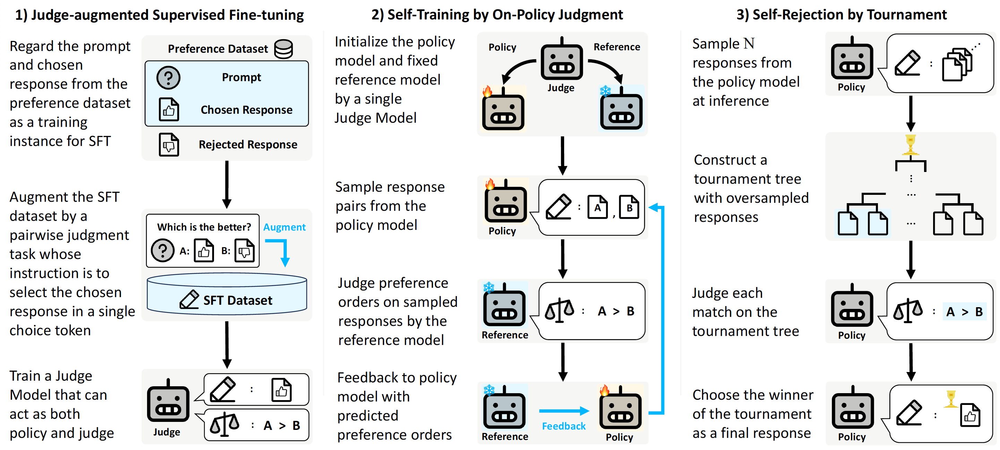

# ⚖️ SELF-JUDGE
> [**Aligning Large Language Models by On-Policy Self-Judgment**](https://arxiv.org/abs/2402.11253),            
Sangkyu Lee<sup>1,*</sup>,
Sungdong Kim<sup>2,3,&dagger;</sup>,
Ashkan Yousefpour<sup>1</sup>, 
Minjoon Seo<sup>3</sup>, 
Kang Min Yoo<sup>2,4</sup>,
Youngjae Yu<sup>1,&dagger;</sup><br>
<sup>1</sup>Yonsei University,
<sup>2</sup>NAVER Cloud, 
<sup>3</sup>KAIST AI,
<sup>4</sup>SNU AI Center<br>
<sup>\*</sup>Work done during internship at NAVER Cloud, 
<sup>&dagger;</sup>Corresponding Author

<p align="center">
  
</p>

This is the official repository of **"Aligning Large Language Models by On-Policy Self-Judgment"** containing:

- Example training scripts for **Judge-augmented Supervised Fine-tuning (JSFT)** 
- Example training scripts and Trainer for **Self-Training by On-policy Judgment**
- The helper function for performing **Self-Rejection by Tournament**

## Installation

Please make sure to set up your environment with `Python 3.10`, then follow the installation:

```
cd src
pip install -r requirements.txt
pip install -e .
cd ../
```

If you want to directly follow the example scripts of this repo, you also need to install `flash-attn` as:

```
pip install flash-attn --no-build-isolation
```


## Judge-augmented Supervised Fine-tuning (JSFT)
In our entire implementations, we utilize [`Templates for Chat Models`](https://huggingface.co/docs/transformers/main/en/chat_templating) on Supervised Fine-tuning and pairwise judgment. For pairwise judgments, we use the following nested dictionary structure for judgment templates:

```python
{'principle_0': {'system': system_message_0,
                 'user': user_template_0,
                 'assistant': assistant_template_0},
 'principle_1': {'system': system_message_1,
                 'user': user_template_1,
                 'assistant': assistant_template_1},
  ...
}
```

For each user template, formatting for `context`, `response_a` and `response_b` is required. The `context` corresponds to the context where the pairwise judgment between two responses is performed (e.g the instruction or prompt given to the assistant), and `response_a` and `response_b` correspond to each response on position A and B for pairwise judgment. You can check how these judgment templates are used to construct training examples for pairwise judgments in `preprocess.py`. To utilizes rationales during training pairwise judgment, decision and rationale templates as in `configs/uf_jsft.yaml` are required. 

The included example training scripts can be used as:

```
# HH-Helpful
accelerate launch --config_file=configs/jsft_accelerate.yaml train_jsft.py --config=configs/hh_jsft.yaml

# UltraFeedback
accelerate launch --config_file=configs/jsft_accelerate.yaml train_jsft.py --config=configs/uf_jsft.yaml

# UltraFeedback with principles and rationale
accelerate launch --config_file=configs/jsft_accelerate.yaml train_jsft.py --config=configs/uf_jsft_pr.yaml
```


## Self-Training by On-Policy Judgment

We provide `SelfJudgeCollator` and `SelfJudgeTrainer` which can be used as:

```python
from self_judge import SelfJudgeCollator, SelfJudgeTrainer

...

data_collator = SelfJudgeCollator()

trainer = SelfJudgeTrainer(
            model=model,
            tokenizer=tokenizer,
            data_collator=data_collator,
            args=training_args,
            train_dataset=train_dataset,
            eval_dataset=eval_dataset,
            **self_judge_args,
            )

trainer.train()
```

`SelfJudgeTrainer` is extended from [`DPOTrainer`](https://huggingface.co/docs/trl/main/en/dpo_trainer) of [`trl`](https://github.com/huggingface/trl) library. Therefore, it shares similar features on usages. However, `SelfJudgeTrainer` now only supports `["sigmoid", "hinge", "ipo"]` for `loss_type`. Additionally, `token_id_a` and `token_id_b` which correspond to the judge token used on JSFT are required. For more arguments specifically required for the `SelfJudgeTrainer`, please check the configurations in `/configs`.

`SelfJudgeCollator` and `SelfJudgeTrainer` assume datasets with the following keys:

- `query`: a string where the model starts the continuation.
- `context`: a string of context for performing the judgment between a sampled response pair.
- `chosen`: a string corresponds to an example of chosen response. **(only used on evaluations)**
- `rejected`: a string corresponds to an example of rejected response. **(only used on evaluations)**

The included example training scripts can be used as:

```
# HH-Helpful
accelerate launch --config_file=configs/self_judge_accelerate.yaml train_self_judge.py --config=configs/hh_self_judge.yaml

# UltraFeedback
accelerate launch --config_file=configs/self_judge_accelerate.yaml train_self_judge.py --config=configs/uf_self_judge.yaml

# UltraFeedback with principles and rationale
accelerate launch --config_file=configs/self_judge_accelerate.yaml train_self_judge.py --config=configs/uf_self_judge_pr.yaml
```

## Self-Rejection by Tournament

From the resulting model, you can perform rejection sampling with `tournament_rejection_sampling` as:

```python
from self_judge import tournament_rejection_sampling

...

contexts = ["context_0", "context_1", ...]
responses = [["response_0_0", "response_0_1"],
             ["response_0_1", "response_1_1", "response_1_2", ...],
             ...
            ]

winners = tournament_rejection_sampling(
            model=model,
            tokenizer=tokenizer,
            judge_templates=judge_templates,
            token_id_a=token_id_a,
            token_id_b=token_id_b,
            contexts=contexts,
            responses=responses,
            max_length=max_length,
            judge_batch_size=judge_batch_sizes,
          )

```

Note that each number of responses for context does not have to be equivalent, but length of `contexts` and `responses` should be equivalent. The returned `winners` is `List` of the best response on given `contexts` through tournament based on the pairwise judgments.

## Citation
```
@article{lee2024aligning,
  title={Aligning Large Language Models by On-Policy Self-Judgment},
  author={Lee, Sangkyu and Kim, Sungdong and Yousefpour, Ashkan and Seo, Minjoon and Yoo, Kang Min and Yu, Youngjae},
  journal={arXiv preprint arXiv:2402.11253},
  year={2024}
}
```